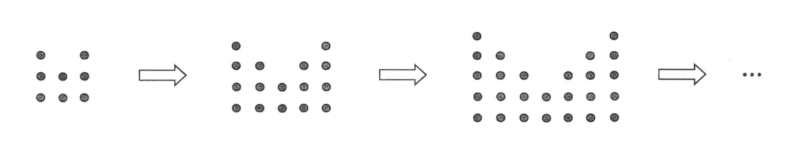
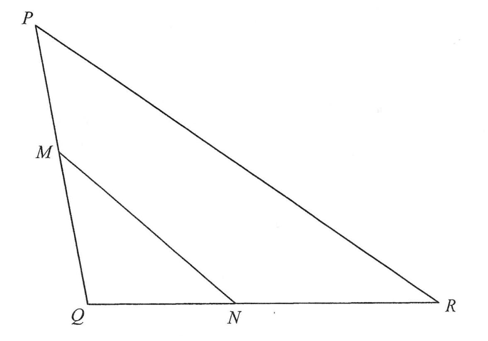
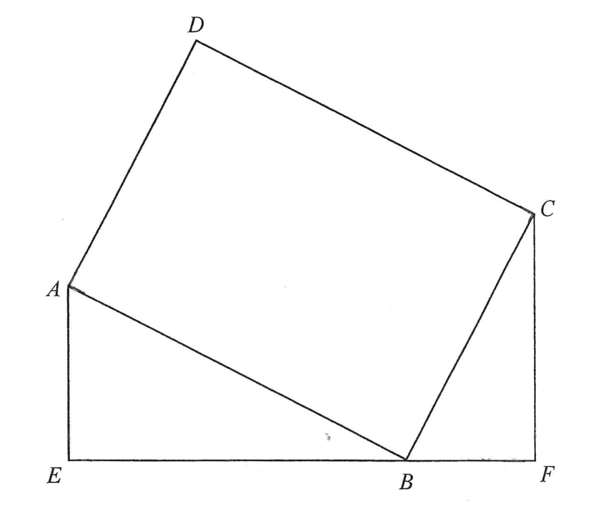
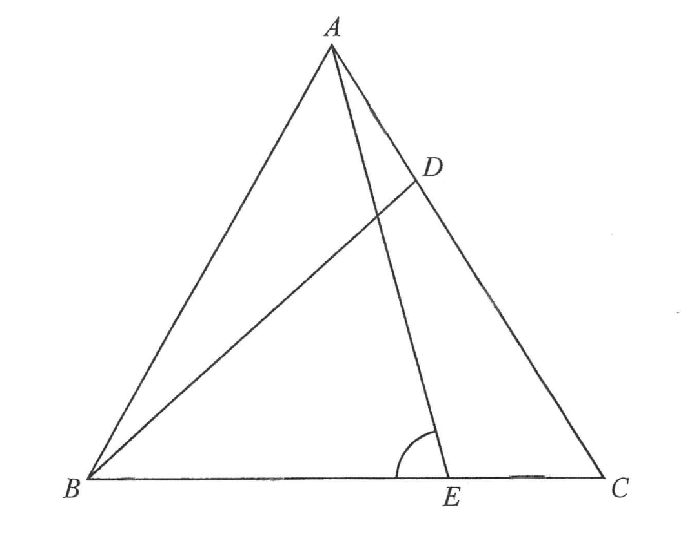
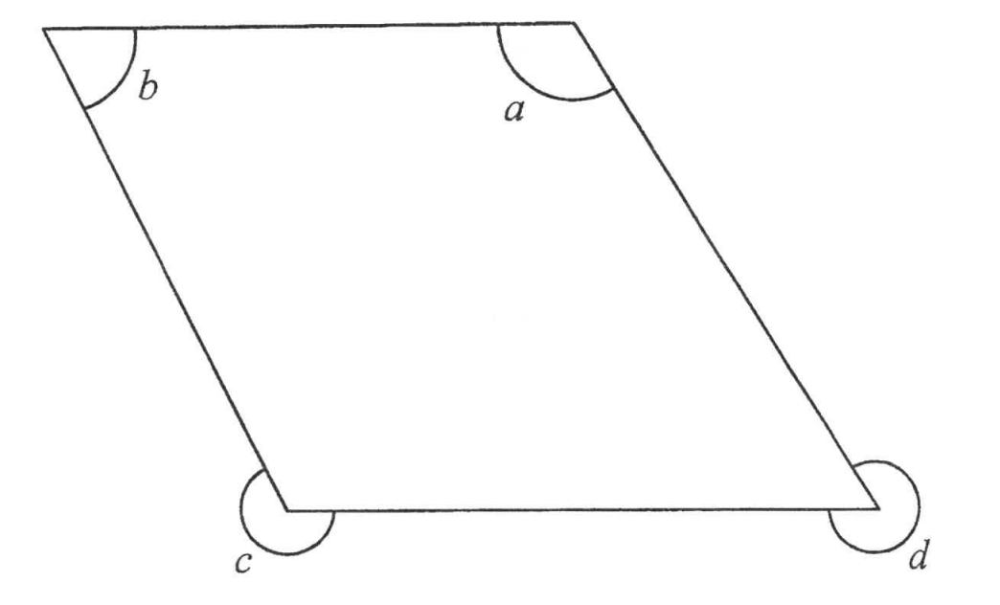
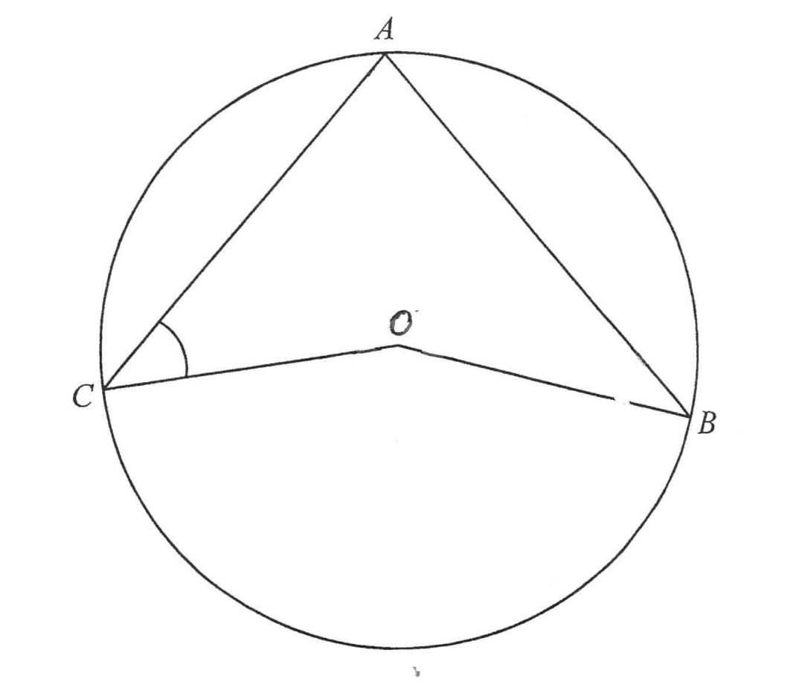
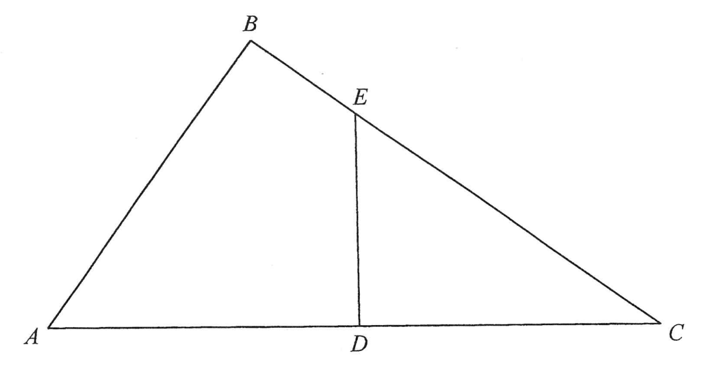
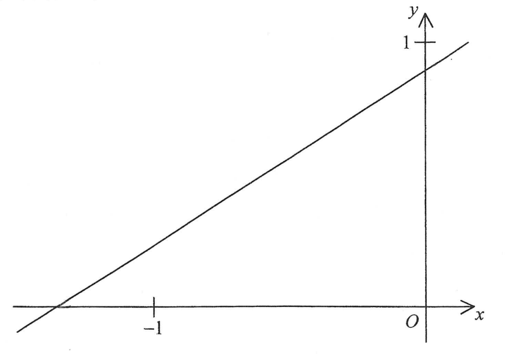
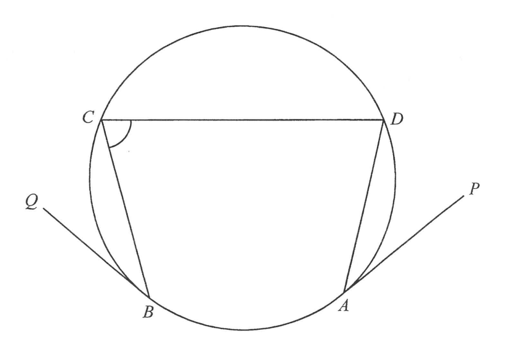
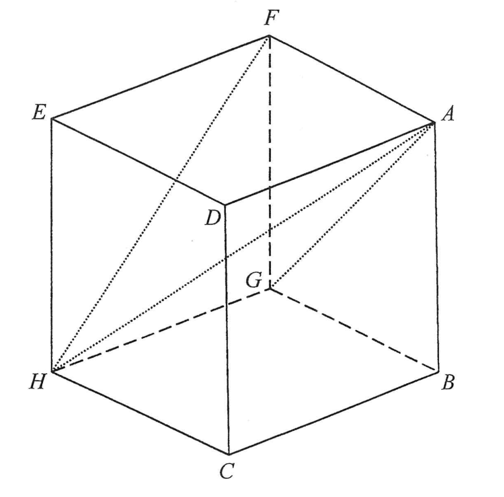

# 2022年香港中學文憑考試 數學 必修部分 試卷二 (甲部及乙部)

## 甲部

**1.** $\alpha^{2}-\alpha-\beta^{2}+\beta=$
A. $(\alpha+\beta)(\alpha-\beta+1)$
B. $(\alpha+\beta)(\alpha-\beta-1)$
C. $(\alpha-\beta)(\alpha+\beta+1)$
D. $(\alpha-\beta)(\alpha+\beta-1)$

**2.** $\frac{81^{2n+3}}{(27^{n+1})^{2}}=$
A. $3$
B. $3^{2n+6}$
C. $3^{4n+8}$
D. $3^{10n+14}$

**3.** 若 $m$ 及 $n$ 均為常數使得 $(x+3)^{2}+mx\equiv(x-n)(x+1)+2n$，則 $m=$
A. $-14$
B. $-8$
C. $4$
D. $9$

**4.** 設 $c$ 為一常數。解方程 $(x-c)(x-4c)=(3c-x)(x-4c)$。
A. $x=2c$
B. $x=3c$
C. $x=c$ 或 $x=3c$
D. $x=2c$ 或 $x=4c$

**5.** 若 $\frac{2}{u}+\frac{3}{v}=4$，則 $u=$
A. $\frac{2v}{4v-3}$
B. $\frac{2v}{3-4v}$
C. $\frac{3v}{4v-2}$
D. $\frac{3v}{2-4v}$

**6.** 已知 $x$ 為一實數。若將 $x$ 下捨入至三位有效數字，則結果為 $345$。求 $x$ 值的範圍。
A. $344 < x \le 345$
B. $345 \le x < 346$
C. $345 < x \le 345.5$
D. $344.5 \le x < 345.5$

**7.** $3y-5<5y+1\le11$ 的解為
A. $-3 < y \le 2$
B. $-3 \le y < 2$
C. $-2 < y \le 3$
D. $-2 \le y < 3$

**8.** 設 $f(x)=x^{2}-x+1$。若 $k$ 為一常數，則下列何者必為正確？
A. $f(k)=f(-k)$
B. $f(k)=f(1-k)$
C. $f(k+1)=f(k)+f(1)$
D. $f(k-1)=f(k)-f(1)$

**9.** 設 $g(x)=x^{2}+ax+b$，其中 $a$ 及 $b$ 均為常數。若 $g(x)$ 可被 $x+2a$ 整除，求當 $g(x)$ 除以 $x-2a$ 時的餘數。
A. $-2a^{2}$
B. $0$
C. $2a^{2}$
D. $4a^{2}$

**10.** 設 $h$ 及 $k$ 均為實常數使得 $hk<0$。下列有關 $y=(h-x)(k-x)$ 的圖像之敘述，何者正確？
I. 該圖像開口向上。
II. 該圖像有兩個 $x$ 截距。
III. 該圖像的 $y$ 截距為正值。
A. 只有 I 及 II
B. 只有 I 及 III
C. 只有 II 及 III
D. I、II 及 III

**11.** 存款 $\$88000$，年利率 $6\%$，年期 $4$ 年，複利計算，每月一結。求利息準確至最接近的元。
A. $\$21120$
B. $\$23098$
C. $\$23803$
D. $\$23825$

**12.** 設 $x$、$y$ 及 $z$ 均為非零的數。若 $x:y=8:5$ 及 $2x=4z-3y$，則 $y:z=$
A. $16:17$
B. $17:16$
C. $20:31$
D. $31:20$

**13.** 若 $u$ 隨 $v$ 的平方根正變且隨 $w$ 反變，則下列何者正確？
I. $u^{2}$ 隨 $v$ 正變且隨 $w$ 的平方反變。
II. $v$ 隨 $w$ 正變且隨 $u$ 的平方根反變。
III. $w$ 隨 $v$ 的平方根正變且隨 $u$ 反變。
A. 只有 I 及 II
B. 只有 I 及 III
C. 只有 II 及 III
D. I、II 及 III

**14.** 圖中，第 $1$ 個圖案包含 $8$ 粒點子。對任意正整數 $n$，第 $(n+1)$ 個圖案是由第 $n$ 個圖案加上 $(2n+6)$ 粒點子所組成。求第 $7$ 個圖案的點子數目。
A. $52$
B. $68$
C. $86$
D. $106$

**15.** 一實心半球體的半徑與一實心直立圓柱體的底半徑相等。若該圓柱體的高等於其底直徑，則該半球體的總表面面積與該圓柱體的總表面面積之比為
A. $1:2$
B. $1:3$
C. $2:3$
D. $2:5$

**16.** 某圓的直徑為 $10\text{ cm}$。一長度為 $8\text{ cm}$ 的弦把該圓分成一優弓形及一劣弓形。求該優弓形的面積準確至最接近的 $\text{cm}^{2}$。
A. $11\text{ cm}^{2}$
B. $23\text{ cm}^{2}$
C. $55\text{ cm}^{2}$
D. $67\text{ cm}^{2}$

**17.** 圖中， $M$ 及 $N$ 分別為 $PQ$ 及 $QR$ 上的點使得 $PM:MQ=5:6$ 及 $QN:NR=3:4$。若四邊形 $MNRP$ 的面積為 $59\text{ cm}^{2}$，則 $\Delta MNQ$ 的面積為 
A. $17\text{ cm}^{2}$
B. $18\text{ cm}^{2}$
C. $19\text{ cm}^{2}$
D. $20\text{ cm}^{2}$

**18.** 圖中，長方形 $ABCD$ 的周界為 $170\text{ cm}$。已知 $EBF$ 為一直線及 $\angle AEB=\angle BFC=90^{\circ}$。若 $AE=24\text{ cm}$ 及 $BC=34\text{ cm}$，則 $EF=$ 
A. $45\text{ cm}$
B. $51\text{ cm}$
C. $61\text{ cm}$
D. $75\text{ cm}$

**19.** 圖中， $ABC$ 為一等邊三角形。設 $D$ 及 $E$ 分別為 $AC$ 及 $BC$ 上的點使得 $AD=CE$。若 $\angle CBD=38^{\circ}$，則 $\angle AEB=$ 
A. $73^{\circ}$
B. $75^{\circ}$
C. $78^{\circ}$
D. $82^{\circ}$

**20.** 圖中所示為一平行四邊形。下列何者必為正確？
I. $a+b=180^{\circ}$
II. $b+c=360^{\circ}$
III. $c+d=540^{\circ}$ 
A. 只有 I 及 II
B. 只有 I 及 III
C. 只有 II 及 III
D. I、II 及 III

**21.** 圖中， $O$ 為圓 $ABC$ 的圓心。若 $\angle ABO=36^{\circ}$ 及 $\angle BOC=164^{\circ}$，則 $\angle ACO=$ 
A. $41^{\circ}$
B. $46^{\circ}$
C. $52^{\circ}$
D. $64^{\circ}$

**22.** 圖中， $ABC$ 為一直角三角形且 $\angle ABC=90^{\circ}$。設 $D$ 及 $E$ 分別為 $AC$ 及 $BC$ 上的點使得 $ABED$ 為一圓內接四邊形。若 $AB=660\text{ cm}$、$AD=572\text{ cm}$ 及 $BE=275\text{ cm}$，則 $CD=$ 
A. $429\text{ cm}$
B. $715\text{ cm}$
C. $728\text{ cm}$
D. $845\text{ cm}$

**23.** 已知 $PQRS$ 為一菱形。設 $T$ 為 $PR$ 與 $QS$ 的交點。若 $\angle QRT=\theta$，則 $\frac{PQ}{ST}=$
A. $\sin \theta$
B. $\cos \theta$
C. $\frac{1}{\sin \theta}$
D. $\frac{1}{\cos \theta}$

**24.** 圖中所示為直線 $mx+ny=3$ 的圖像。下列何者正確？
I. $m<0$
II. $n>3$
III. $m+n=0$ 
A. 只有 I 及 II
B. 只有 I 及 III
C. 只有 II 及 III
D. I、II 及 III

**25.** 點 $A$ 的直角坐標為 $(4\sqrt{3},-4)$。若 $A$ 繞原點順時針方向旋轉 $90^{\circ}$，則它的像的極坐標為
A. $(8,60^{\circ})$
B. $(8,120^{\circ})$
C. $(8,210^{\circ})$
D. $(8,240^{\circ})$

**26.** 直線 $12x-5y=60$ 分別與 $x$ 軸及 $y$ 軸相交於點 $A$ 及點 $B$。設 $P$ 為直角坐標平面上的一動點使得 $AP=BP$。求 $P$ 的軌跡的方程。
A. $10x+24y+119=0$
B. $15x+36y+179=0$
C. $x^{2}+y^{2}-5x+12y=0$
D. $x^{2}+y^{2}+12x-133=0$

**27.** 點 $P$ 及點 $Q$ 的坐標分別為 $(10,-24)$ 及 $(17,-7)$。設 $C$ 為通過原點、 $P$ 及 $Q$ 的圓。下列何者正確？
A. $PQ$ 為 $C$ 的一直徑。
B. $C$ 的面積為 $196\pi$。
C. 點 $(16,-9)$ 位於 $C$ 以內。
D. $C$ 的圓心在直線 $5x+12y=0$ 上。

**28.** $5\bigcirc2$ 為三位數，其中 $\bigcirc$ 為 $0$ 至 $9$（包括 $0$ 及 $9$）內的整數。求該三位數可被 $7$ 整除的概率。
A. $\frac{1}{5}$
B. $\frac{1}{7}$
C. $\frac{1}{9}$
D. $\frac{1}{10}$

**29.** $60$ 名男演員和 $40$ 名女演員的平均體重為 $57\text{ kg}$。若男演員的平均體重為 $63\text{ kg}$，則女演員的平均體重為
A. $48\text{ kg}$
B. $50\text{ kg}$
C. $53\text{ kg}$
D. $60\text{ kg}$

**30.** 考慮以下正整數：
$2, 5, 6, 6, x, x, x, y$
若以上正整數的平均值及中位數均為 $6$，則下列何者必為正確？
I. 以上正整數的眾數為 $6$。
II. 以上正整數的最小可取分佈域為 $6$。
III. 以上正整數的最大可取方差為 $6$。
A. 只有 I
B. 只有 II
C. 只有 I 及 III
D. 只有 II 及 III

## 乙部

**31.** 下列何者最小？
A. $(-345)^{768}$
B. $453^{-786}$
C. $(\frac{1}{435})^{867}$
D. $(\frac{2}{543})^{876}$

**32.** 已知 $\log_{a}y$ 為 $x$ 的線性函數，其中 $0<a<1$。該線性函數的圖像在垂直軸上的截距及在水平軸上的截距分別為 $6$ 及 $3$。若 $y=mn^{x}$，則下列何者正確？
I. $m<1$
II. $n<1$
III. $mn^{3}=1$
A. 只有 I
B. 只有 II
C. 只有 I 及 III
D. 只有 II 及 III

**33.** 若 $\log_{4}y=2x-1$ 及 $(\log_{4}y)^{2}=20x-31$，則 $\log_{2}y=$
A. $1$ 或 $2$
B. $2$ 或 $4$
C. $3$ 或 $7$
D. $6$ 或 $14$

**34.** $12\text{B}00\text{CD}000000E_{16}=$
A. $299\times4^{22}+205\times4^{14}+14$
B. $300\times4^{22}+222\times4^{14}+15$
C. $299\times4^{24}+205\times4^{16}+14$
D. $300\times4^{24}+222\times4^{16}+15$

**35.** 設 $z=4+5i^{10}-ki^{15}+6i^{21}+2ki^{28}$，其中 $k$ 為一實數。若 $z$ 的實部與虛部相等，則 $z$ 的實部為
A. $7$
B. $13$
C. $17$
D. $25$

**36.** 考慮以下的不等式組：
$\begin{cases}2x+y\ge8\\ 2x+3y\ge16\\ 4x+3y\le22\end{cases}$
設 $R$ 為表示以上的不等式組的解之區域。若 $(x,y)$ 為 $R$ 中的一點，則 $7x+6y$ 的最小值為
A. $32$
B. $38$
C. $41$
D. $43$

**37.** $a_{n}$ 為一等比數列的第 $n$ 項。已知 $a_{1}=8p^{2}$、$a_{2}=1$ 及 $a_{3}=27p$，其中 $p$ 為一實數。求 $a_{4}$。
A. $\frac{1}{6}$
B. $\frac{2}{9}$
C. $\frac{9}{2}$
D. $\frac{81}{4}$

**38.** 圖中， $ABCD$ 為一圓。 $PA$ 及 $QB$ 分別為該圓在 $A$ 及 $B$ 的切線。若 $\angle ADC=79^{\circ}$、 $\angle CBQ=39^{\circ}$ 及 $\angle DAP=42^{\circ}$，則 $\angle BCD=$ 
A. $76^{\circ}$
B. $79^{\circ}$
C. $81^{\circ}$
D. $82^{\circ}$

**39.** 當 $0^{\circ}\le x<360^{\circ}$ 時，方程 $\sin^{2}x=6\cos^{2}x$ 有多少個根？
A. $2$
B. $3$
C. $4$
D. $5$

**40.** 圖中， $ABCDEFGH$ 為一正方體。設 $\alpha$ 為平面 $AFG$ 與平面 $AFH$ 間的交角，而 $\beta$ 為平面 $AFH$ 與平面 $AFGH$ 間的交角。下列何者正確？ 
A. $\alpha < 60^{\circ} < \beta$
B. $\alpha < \beta < 60^{\circ}$
C. $60^{\circ} < \alpha < \beta$
D. $60^{\circ} < \beta < \alpha$

**41.** 設 $O$ 為原點。點 $A$ 及點 $B$ 的坐標分別為 $(a,0)$ 及 $(0,b)$，其中 $a$ 及 $b$ 均為正數。若 $\Delta OAB$ 的外心在直線 $4x+16y=17a$ 上，則 $a:b=$
A. $8:15$
B. $15:8$
C. $16:47$
D. $47:16$

**42.** 若七位密碼的首五個位及尾兩個位分別由 $1,3,5,7,9$ 的排列及 $2,8$ 的排列所組成，則可組成多少個不同的七位密碼？
A. $10$
B. $240$
C. $480$
D. $5040$

**43.** 一盒子內有 $2$ 個白球、 $2$ 個黃球及 $3$ 個紅球。某男生及某女生輪流從該盒子中隨機取一個球，且取球後須放回該盒子中，直至其中一人取出白球或黃球為止。該男生首先取球。求該女生取出白球的概率。
A. $\frac{3}{10}$
B. $\frac{3}{20}$
C. $\frac{7}{20}$
D. $\frac{17}{20}$

**44.** 某測驗中，一班學生的測驗得分的中位數為 $30$ 分。全部學生在該測驗均不及格，故此將每名學生的測驗得分調整，使每個得分均增加 $50\%$ 然後額外加 $8$ 分。設 $x$ 分為該班學生在得分調整後的測驗得分的中位數。該測驗中，某學生在得分調整前的標準分為 $-2$。將這學生在得分調整後的標準分記為 $z$。求 $x$ 及 $z$。
A. $x=45$ 及 $z=-2$
B. $x=45$ 及 $z=-1$
C. $x=53$ 及 $z=-2$
D. $x=53$ 及 $z=-1$

**45.** 已知 $d$ 為一實數。設 $S_{1}$ 為一組數 $\{d-6,d-2,d-1,d+3,d+5,d+7\}$ 而 $S_{2}$ 為另一組數 $\{d-7,d-5,d-3,d+1,d+2,d+6\}$。下列何者正確？
I. $S_{1}$ 與 $S_{2}$ 的平均值相等。
II. $S_{1}$ 與 $S_{2}$ 的標準差相等。
III. $S_{1}$ 與 $S_{2}$ 的四分位數間距相等。
A. 只有 I
B. 只有 II
C. 只有 I 及 III
D. 只有 II 及 III
